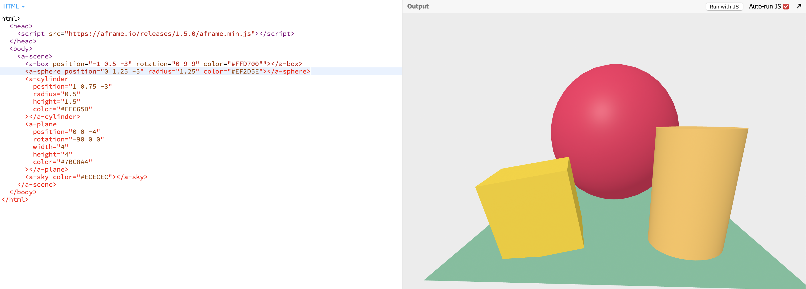

# Entry 4: music
##### 2/24/24

## Content
The tool I chose to use on my freedom project was Aframe because it had cool animations and  it could make my website better. I tinkered Aframe by using jsbin and changing colors of a  shape to gold, Aqua, and Lime green. The code I used was
```shell
 <a-box position="-1 0.5 -3" rotation="0 9 9" color="#FFD700"></a-box>
 ```
  This made the box have a gold color and made the box tilted due to the rotation if we want it to make it straight we would do `rotation="0 0 0 "`. The positioning describes how far the shape is from the plane field. The image of the code I changed is below

  

  ### Sources
  - To learn Aframe and to practice it I am using [glitch](https://glitch.com/edit/#%2521%252Ffalse-seen-tumbleweed%253Fpath%253Dindex.html%253A26%253A0) to see the code for creating the shapes, colors etc. . To add, I am using [aframe website](https://glitch.com/edit/#%2521%252Ffalse-seen-tumbleweed%253Fpath%253Dindex.html%253A26%253A0) to learn the interface of element's

## Engineering Design Process
 I am currently going into step 4 **planning the promising solution** I decided how to engage people about innovations in music by having a readable and informative website using `aframe` to make my website better.

## Skill
The two skills I have obtained were **Organization** and **Attention to detail**

#### **Organization**
- One way I have Obtained this skill is to organize your thoughts and try to practice your thoughts in code and see how your website/ The project you're making will turn out
#### **Attention to detail**
- One way I learned to pay attention to detail is when I code and I need to correctly put elements with their corresponding selector.

### Summary
I plan to learn more skills like **consideration** and **Embracing failure** in my project  because embracing and showing failure is a part of learning


[Previous](entry03.md) | [Next](entry05.md)

[Home](../README.md)


