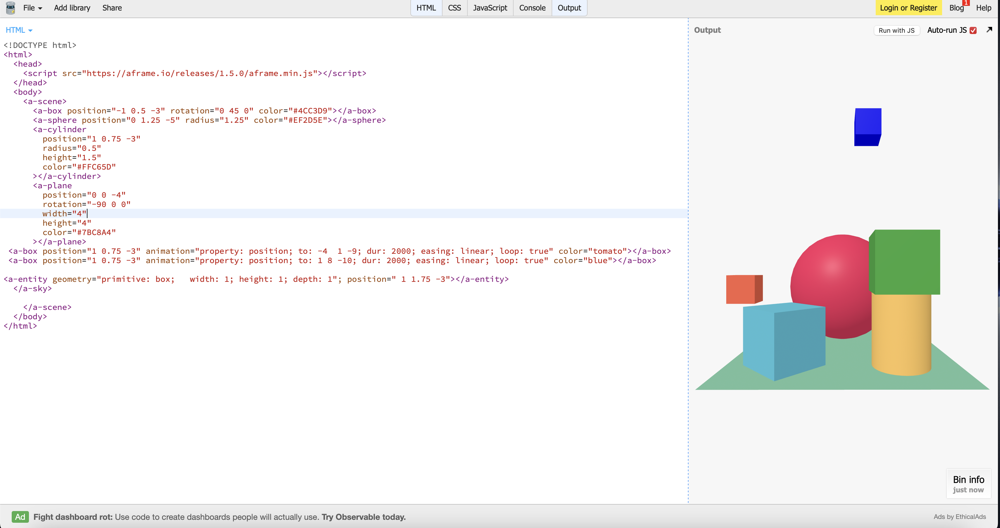
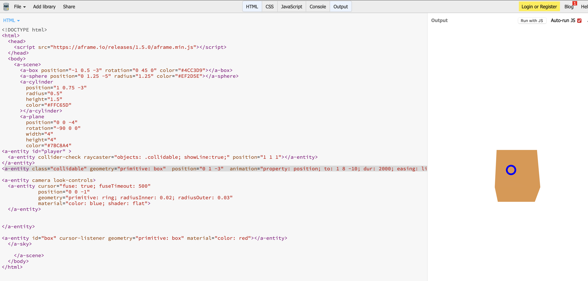
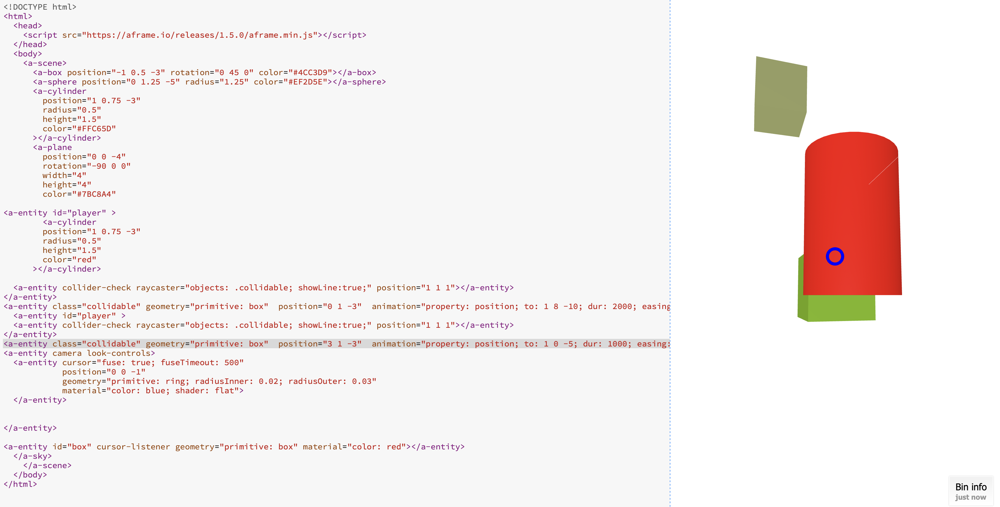

# Entry 5: Music
##### 4/14/24

## Content
Some things I learned about using aframe was the animations, sound components, differemt shapes, cursor's ect... . For instance, When I used the animation component's I was able to decide how to use it(different easing's). The page about animation on [aframe](https://aframe.io/docs/1.5.0/components/animation.html) really helped me out and a video on youtube. In general, videos on youtube and the offical website helped me out because some things were tricky like the animation component. To sum up, using aframe taught me how to make 3d and animated objects and make animations which peaked my intrest.

### Using the Animation component-
*  One thing I **changed** when using animation was the positoning of the object and how  I wanted it to be animated(Translating a box) as well as the color.
* The code I used was
`
 <a-box position="-4 1.6 -5" animation="property: position; to: 1 8 -10; dur: 2000; easing: linear; loop: true" color="tomato"></a-box>
 `

 this code was for one box but then one thing I **made** was making another box but with a different position and color.
 * The code I used for making another animated  box was
  `<a-box position="1 0.75 -3" animation="property: position; to: 1 8 -10; dur: 2000; easing: linear; loop: true" color="blue"></a-box>
`
* Finally, I made a geometry shape(a box ) and gave it a position
#### The final product

### Using the cursor component
Before I explain what I changed, and made and my progress, we need to know what a cursor is and a raycaster.
* What is a Cursor?
   * A cursor is a hover component that has  a camera built to see control base interactions.
* What is a raycaster?
   * A raycaster is checking for events and the intersections that cross it
#### Things I changed
* One thing I changed was the color of the cursor  and Positioning the cursor to the raycaster
    * The code I used was
    `
<a-entity camera look-controls>
  <a-entity cursor="fuse: true; fuseTimeout: 500"
            position="0 0 -1"
            geometry="primitive: ring; radiusInner: 0.02; radiusOuter: 0.03"
            material="color: red; shader: flat">
  </a-entity>
  `

As you see `material="color: red; ` means the camera cursor turns red.

* Another thing I changed was making the raycastor have an animation
     * The code for making a raycaster
    `<a-entity id="player" >
  <a-entity collider-check raycaster="objects: .collidable; showLine:true;" position="1 1 1"></a-entity>
</a-entity>
`

This made a raycastor and what I changed is making it move as an animation using the code
* `<a-entity class="collidable" geometry="primitive: box"  position="0 1 -3"  animation="property: position; to: 1 8 -10; dur: 2000; easing: linear; loop: true" color="blue"></a-entity>
`
##### Takeaways for cursor
Using what I learned from animations I added onto with cursor and raycaster's
##### Final product

#### Things I made
* I made a red cylinder in raycastor
* I made another animated box
     * Code used
     `<a-entity class="collidable" geometry="primitive: box"  position="3 1 -3"  animation="property: position; to: 1 0 -5; dur: 1000; easing: linear; loop: true" color="blue"></a-entity>
`

My final product

## Sources
To learn animation I used  the [aframe page ](https://aframe.io/docs/1.5.0/components/animation.html) about animation to make different  easings and animatins like translating a box or going around a certain object.

## Engineering Design Process
As of right now  I am in step 4  **planning the promising solution** where I have decided how to use aframe  in my website going into step 5 **Creating a protype** in this case a website that informs people  about Music in technoilogy and using aframe to exopand on this idea

## Skill
 The two skills I learned while using aframe was **Embracing failure** and **how to  learm**

 #### Embracing failure
 - One way  I have used this skill is when I used the sound component and was struggling how to import a sound but as I learned more I was able to learm from this error and problem

 #### How to learn
 - One way I have used this skill is when  I had to use resources and research to better understand afame and it's components

 ### Summary/My next steps
 I plan on making a website using the sound component.

[Previous](entry04.md) | [Next](entry06.md)

[Home](../README.md)
