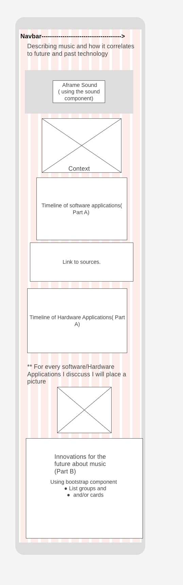

# Plan

## Wireframes
* 
* [Desktop](https://wireframe.cc/nRjmyh)

## Colors
* `#ff781f(a light orange)`
* Black and white
* dark blue/light blue

## Fonts
* [Oswald](https://fonts.google.com/specimen/Oswald)

## Timeline

#### MVP

* 4/17--> Add navbar
* 4/18- 4/19/24 -->  Adding fp tool: Aframe and  Context
    * Using * Add animation using Aframe
* 4/20/24 --> adding  Carosoul OF timeline of Software Applications (Part A)
    * 4/4 slides with logos of the the software's
* 4/21-4/25/24 --> Hardware application timeline
    * +Pictures/logos
* 4/26 -->  Innovations about music for the future(Part B)
    * ( Bootstrap component- List groups and/or cards)

4/27-29/24-->
* Position it, make sure it has the fonts chosen and give it a color. (checking for errors)
#### If not done with everything by 4/28- /4/29/24 then,
* if two  days behind then
    * 4/27/24-  day 1
    * 4/28-4/29 - Day 2

---

#### Beyond MVP

*  Add fonts
* add images and colors
* Sound component for aframe
