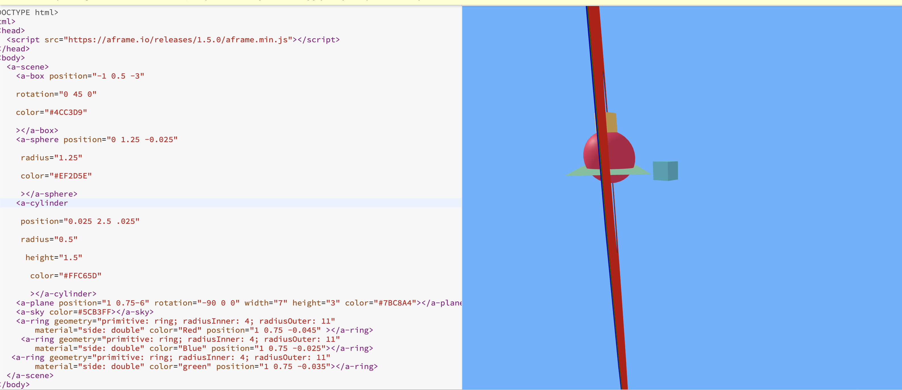

# Tool Learning Log

Tool: **Aframe**

---

3/3/24:
* watched a video about position using Aframe _*[Youtube video](https://www.youtube.com/watch?v%253DliOLtcPmMa0)_*
* read the documentation of positioning on  the Aframe [page](https://aframe.io/docs/1.5.0/components/position.html)
 ##### Things I changed  using the video
- I used aspect ratio to change the width, height, and depth of a shape, I made the `height="0.1"`, `Width="2"` `position=" 1, 0.75,-2`
 
 #### Things made
 - Using the aframe page and using the code I made a cylinder stack upon the first cylinder, I changed the color and I created a cone on top of both cylinders
 * The code That I used for creating a cone was
 `
 <a-cone
        position=" 1 1.5 -2"
        radius="0.5"
        height="0.5"
        color="#0000FF"
        width= "8"
        depth="1.2"
      ></a-cone>

* The code I used for creating a cylinder was
`
 <a-cylinder
     position=" 1 1 -2"
     radius="0.5"
    height="0.5"
    color="#0000FF"
    width= "8"
    depth="1.2"
     ></a-cylinder>
#### End product


### Challenges
* The challenge I faced when trying to make new shapes using positions, width, and height was making sure it was the way I wanted and making sure the shapes/Entity had the right position( on top of the cylinder/s) I found making everything the way I wanted difficult but using the video tutorial and the Aframe webpage I was able to found out what was x,y and z in the
`a-entity position="x y z"></a-entity>
` code

### Questions
Is it possible to make an entity inside an entity code?> for example `a-circle` inside the code for `a-clyinder`?

### Next steps
* Try other components and their meaning and how I can use them on my fp(freedom) project

3/9/24:

* **Watched 15 minutes about creating Geometry objects and changing colors,width,height ect on an object  [Youtube video](https://www.youtube.com/watch?v%253DnRK6-FKobis)**
* read the documentation of Geometry(objects) on  the Aframe [page](https://aframe.io/docs/1.5.0/components/geometry.html)


##### Things I changed using both the documentation and video
* I changed the sky color to a crystal blue color. The code I used was
` <a-sky color=#5CB3FF></a-sky> `.
* I created a geometry object(ring) and I Made it have a color of red and changed the `radius:inner` and `Radius:outter`.
* The code I used was

 `<a-ring geometry="primitive: ring; radiusInner: 4; radiusOuter: 10"
          material="side: double" color="red"></a-ring>
    `
   

#### Things I made
* I changed the plane position to go inside the ring
* The code I used for this was
` <a-plane position="0 1-4" rotation="-90 0 0" width="4" height="4" color="#7BC8A4"></a-plane>
`
* I modified the ring to have a position and created 2 other rings. I made a ring with a blue color and another one with green. Finally, I tested out the position and see if it lined up the way I wanted and it did.
* The code I  used was

`
 <a-ring geometry="primitive: ring; radiusInner: 4; radiusOuter: 11"
          material="side: double" color="Red" position="1 0.75 -0.045" ></a-ring>
       <a-ring geometry="primitive: ring; radiusInner: 4; radiusOuter: 11"
          material="side: double" color="Blue" position="1 0.75 -0.025"></a-ring>
     <a-ring geometry="primitive: ring; radiusInner: 4; radiusOuter: 11"
          material="side: double" color="green" position="1 0.75 -0.035"></a-ring>
    `
* Final product

### Challenges
The challenge I faced  was when  I placed an object because I had to make it the way I wanted. I wanted it to line up but whenever I created a new ring it Overlapsed with the first ring so I had to change the Position. After looking back at Aframe and the way I did it before, it helped me change where the ring went and how it was placed.
### Questions
How can I use a 360 image as an image? like for example if I wanted the `<a-sky>` to be a picture instead of a color

## What I plan to do next
* _Study one more component_
___
3/16/24:

Some things I did to practice the components of aframe were
*  practiced what I learned for the past weeks and tried to make something using what I learned
* The new component I learned was light and I read a documetation about it [light](https://aframe.io/docs/1.5.0/components/light.html#adding-real-time-shadows)

##### Things I made  from reading the documentation
*  I tried to make a `point` light which is basically a light that affects materials based on where they are located in
* The  code I used for this was
```
  <a-entity light="type: point; intensity: 5  distance: 0; decay: 0"
          position="1 0.75 1.75"></a-entity>
```
and I added a shadow to the image to make the scene less dark
* The code I used was
```
   <a-scene shadow="type: pcfsoft">


</a-scene>
```
### end product


## Practicing what I learned
 Some things I made were
*  a geometry shape called "octahedron"
   * The code I used for this was ` <a-octahedron position="-2.5 0.5 0.5" color="red" radius="0.45"></a-octahedron>`
*  made a triangle
   * The code I used for this was
   ```
    <a-entity geometry="primitive: triangle" material="side: double" color="Blue" position="1 3 -3"></a-entity>
   <a-entity geometry="primitive: triangle" material="side: double" color="Blue" position=".5 2 -3"></a-entity>
    <a-entity geometry="primitive: triangle" material="side: double"color="Blue" position="1.5 2 -3"></a-entity

      ```
Made three triangles facing each other
* The last thing I made was a shape called " Torus"
   * The code I used for this was
```
      <a-entity geometry="primitive: torus; radius: 5; radiusTubular: .5; arc: 360" color="Red" position="0.025 0.75 -0.045"></a-entity>
```
The things I changed was made the radius bigger(the inside)


### Final product

#### Challenges
One challenge I faced was the light part because It showed a shadow on top of the three shapes and when I added the shadow code, it no longer had a shadow. Another challenge I faced was deciding which component to do because some require animation and I haven't done that yet.
#### Questions
* Is there a way to make my shape's have a color because there was an error. One example is ` <a-octahedron`
### *what I plan to do next*
* Learning animation and cursor
x/x/xx
<!--
* Links you used today (websites, videos, etc)
* Things you tried, progress you made, etc
* Challenges, a-ha moments, etc
* Questions you still have
* What you're going to try next
-->

x/x/xx
<!--
* Links you used today (websites, videos, etc)
* Things you tried, progress you made, etc
* Challenges, a-ha moments, etc
* Questions you still have
* What you're going to try next
-->

x/x/xx
<!--
* Links you used today (websites, videos, etc)
* Things you tried, progress you made, etc
* Challenges, a-ha moments, etc
* Questions you still have
* What you're going to try next
-->
